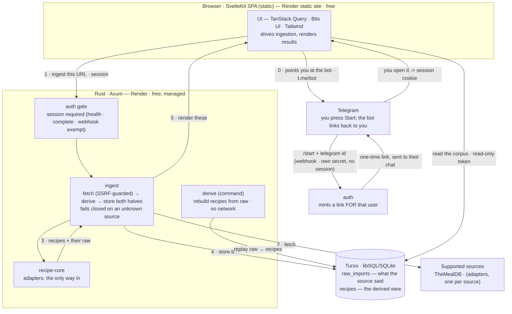

# recipes

A cooking **recipe aggregator** — it normalizes recipes from public sources into
one shape and builds them into a searchable corpus. It is _not_ a CMS: you don't
author recipes here, and the corpus is **a cache of sources we support, not user
input**.

## Architecture



**The client drives ingestion; the server performs it.** The client decides what
to look for. The server fetches it, derives recipes, and stores both halves. The
browser parses nothing.

That split is deliberate, and it is why there is **no WASM**. An in-browser copy
of the normalizer only ever existed to parse arbitrary pages the browser had
fetched itself — and the corpus no longer ingests arbitrary pages (see
adapters). Once the server does the fetching it already holds the bytes, so
normalizing there means one normalizer instead of two, nothing to trust from a
client, and nothing for a visitor to download. It also lets a source require a
credential: an API key can live in a Render env var, which a public SPA could
never hold.

### Auth is mandatory

**Search, browse, read and ingest all require a session.** The only endpoints
that do not are the ones that cannot: `/api/health` (a prober holds no session),
`/api/auth/complete` (redeeming the bot's link _is_ how you get a session, so
requiring one would be circular — the secret in the link is the authentication),
and `/api/telegram/webhook` (called by Telegram, not a browser; it authenticates
with its own shared secret instead).

**The bot logs you in; the site only points at it.** You press Start, the bot
replies **to you** with a one-time link, and opening it sets the session cookie
in your browser. A bot cannot message someone who has not contacted it first, so
the familiar "we'll DM you a link" is impossible — you message it.

The direction is load-bearing, and it is not the obvious one. A flow where the
browser starts a login and waits for a tap hands the capability to _redeem_ to
whoever **started** it, while the identity comes from whoever **tapped** — so an
attacker starts a login, sends you the link, and takes your session when you
tap. That was built here and reproduced as a full account takeover before this
design replaced it. The accepted cost: the session lands in whichever browser
opens the bot's link, so cross-device sign-in does not work. Cross-device
transfer _is_ the attack.

Auth exists because **#20 needs identity** — a group deciding what to cook is a
headcount, and "everyone said yes" means nothing without knowing who everyone
is. It is not what protects the corpus; adapters already do that (below).
Requiring Telegram to use the site at all is a deliberate product call.

### Adapters: the only way in

An adapter is a source we support — an id, a host matcher, and a normalizer.
`recipe-core::adapters::normalize` is the single entry point **and the gate**:
it derives the host from the URL and **fails closed** for any host no adapter
claims, even one serving a perfectly valid recipe.

Arbitrary-domain import was removed. If adapters are needed to normalize well
anyway, supporting the whole web buys nothing — it only yields mediocre data for
sites nobody has looked at, and means normalizing pages an attacker authored. A
generic schema.org adapter is kept but demoted: its allowlist is empty, so it
claims nothing until a domain is deliberately allowlisted into it.

### The corpus has two halves

- **`raw_imports`** — each recipe's payload, exactly as its source gave it.
- **`recipes`** — the **derived** view that search and browse read.

`recipes` is derived, so it can always be rebuilt: `recipe-backend derive`
replays every stored payload through the current adapter, **with zero upstream
calls**. That matters because re-fetching is not a recovery plan — sources 502
scrapers (Serious Eats does), disappear, and paywall. A normalization fix
therefore reaches rows imported before the fix existed.

Raw is not an archive of everything downloaded — **we only want recipes**. A
category listing is a taxonomy, and a browse returns partials we refuse to
store, so neither leaves a payload. 25 recipes cost ~61 KB of raw; all 747 of
TheMealDB would be ~1.5 MB against a 5 GB tier.

### Why these choices

| Decision       | Choice                                                           | Why                                                                                                                                                                                                                                   |
| -------------- | ---------------------------------------------------------------- | ------------------------------------------------------------------------------------------------------------------------------------------------------------------------------------------------------------------------------------- |
| Backend host   | **Render** — free, managed, runs a Rust Docker image             | Keeps Rust without a self-managed box, and is **actually free** at our size. Shuttle's free tier ended 2025‑12‑19; Fly.io removed its free allowances in 2024; a VPS (Hetzner) would mean owning host security/patching.              |
| Database       | **Turso** — libSQL/SQLite, 5 GB free                             | Managed SQLite: our original SQLite cache design maps over almost 1:1, with no persistent-volume host to run.                                                                                                                         |
| Frontend       | **SvelteKit** SPA (`adapter-static`) on a **Render static site** | The UI is a static bundle. Render static sites are permanently free and never spin down (unlike the free web service), and it keeps the frontend on a host we already run.                                                            |
| Processing     | **Server-side**, in `recipe-core` (native)                       | The server fetches, so it already holds the bytes — one normalizer, no client to trust, no bundle to download, and a source may require a key. In-browser WASM existed only to parse arbitrary pages, which we no longer do.          |
| Backend scope  | auth + ingest + derive                                           | The jobs that genuinely require a server: cross-origin fetches, holding secrets, and owning what enters the corpus. Fetching is something ingest does, not an endpoint of its own — there is no URL a caller can aim.                 |
| Accounts       | **Telegram** bot; it links back to you                           | No email vendor to vet, no sender domain, no SPF/DKIM/DMARC, and no spam folder to lose a login in. A bot can't message a stranger, so the link goes to the bot — which also deletes the email-bombing vector. Costs: needs Telegram. |
| PR screenshots | **Cloudflare R2** public bucket                                  | GitHub has no API to attach images to a comment, so they must be hosted and embedded by URL. R2 is genuinely $0 here (10 GB, egress always free) and serves unsigned public URLs. Render has no object storage.                       |

**The infra today is Render + Turso**, plus **Cloudflare R2** for PR screenshots
only — that is the whole vendor list, so nothing else should be described as
"already in the stack". That's a statement of fact, not a ban: adding a service
is a decision to take deliberately when something needs it.

Paths not taken, and why: an all-in-one Cloudflare (Workers + D1 + KV) is
cheaper still, but its free CPU cap forces a TypeScript backend — it would mean
dropping Rust. Vercel's free tier has no always-on server and treats Rust as a
community runtime. Both are reasons they don't host **this Rust backend** — not
verdicts on the vendors.

## Layout

```
crates/recipe-core   normalization — adapters (the gate) + models + per-source normalizers
backend/             Axum: ingest · derive · corpus store · SSRF-guarded fetching (deploys to Render)
frontend/            SvelteKit SPA — TanStack Query · Bits UI · Tailwind (parses nothing)
frontend/.storybook  Storybook — every UI state declared as a story (see below)
flake.nix            rainix dev shell (Rust + Node) + storybook-shot
```

## Getting started

The dev toolchain comes from [rainix](https://github.com/rainlanguage/rainix)
via Nix — Rust, Node, and the shared formatting/CI tooling:

```sh
nix develop
```

- **Tests:** `cargo test`
- **Backend:** `cargo run --manifest-path backend/Cargo.toml` (serves on :8080)
- **Migrate:** `cargo run --manifest-path backend/Cargo.toml -- migrate`
- **Derive:**
  `cargo run --manifest-path backend/Cargo.toml -- derive [<source>]` — rebuild
  `recipes` from `raw_imports`, no network
- **Frontend:** `cd frontend && npm ci && npm run dev`
- **Storybook:** `cd frontend && npm run storybook`

### UI states live in Storybook

Every state a user can see is **declared as a story** rather than reached by
driving the live app — `Pending`, `Error` and `Empty` are impractical to reach
by clicking, and the problem grows as states multiply. Components take their
state as props (e.g. `SearchResults` takes `status: idle|pending|error|ready`),
so the page owns the query and the component owns rendering. Story fixtures
mirror **real** source records; invented ids render as the wrong meal.

### Screenshots for a UI PR

Storybook and screenshots are complementary — Storybook declares the states,
screenshots pin the work at hand onto a PR. Because each story is its own URL,
capture is just navigate-and-shoot; no browser automation is involved.

```sh
(cd frontend && npm run build-storybook)
nix run .#storybook-shot                  # every story -> ./screenshots (gitignored)
nix run .#storybook-shot -- results       # only ids matching a regex
```

`WIDTH`/`HEIGHT`/`SCALE`/`OUT_DIR` tune the capture. The flake pins the two
things that otherwise silently break it: `chromium` (not `ungoogled-chromium`,
which crashes headless) and a fontconfig with generic aliases — without it text
renders invisibly, and with fonts but no aliases a Tailwind sans UI renders
serif.

Shots are uploaded to a Cloudflare R2 public bucket and embedded in the PR by
URL (GitHub has no image-upload API). See `.env.example`; run it by hand — it is
deliberately not in CI.

## Deploying

The whole deploy is `render.yaml` — a Render **Blueprint**, so it lives in the
repo rather than in someone's memory of a dashboard. Apply it from the Render
dashboard (New → Blueprint); it prompts for every secret marked `sync: false`,
none of which are in git.

|                             |                                   |
| --------------------------- | --------------------------------- |
| `recipes.lehlehleh.com`     | static site → the SPA             |
| `api.recipes.lehlehleh.com` | web service → Rust/Axum in Docker |

**Two subdomains of one domain, deliberately.** They are the _same site_, which
is what lets one `SameSite=Lax` cookie authenticate both the REST calls and
#20's WebSocket. `onrender.com` is on the
[Public Suffix List](https://publicsuffix.org/list/), so two `*.onrender.com`
subdomains would be different _sites_ and no shared cookie would be possible at
all. Render's free tier includes two custom domains with managed TLS — exactly
these, at $0.

Then point Telegram at the webhook, once the API has a public URL:

```sh
curl -X POST "https://api.telegram.org/bot$TELEGRAM_BOT_TOKEN/setWebhook" \
  -d "url=https://api.recipes.lehlehleh.com/api/telegram/webhook" \
  -d "secret_token=$TELEGRAM_WEBHOOK_SECRET"
```

`secret_token` is not optional: the webhook URL is public, so without it anyone
can POST a forged `/start` claiming any Telegram id — i.e. log in as anybody.

Two traps worth knowing before they cost an afternoon:

- `lehlehleh.com` is on Cloudflare and **proxied**. Render's certificate
  issuance wants **DNS-only** (grey cloud) at least until the domain verifies,
  or the challenge fails and Render looks broken.
- Migrations run at startup inside the binary, so there is no release step to
  forget — but auth config is validated at startup too. A missing
  `TELEGRAM_BOT_TOKEN` or `COOKIE_SECURE` means the service **refuses to boot**
  rather than 500ing on the first request. That is deliberate: with auth
  mandatory, a backend that cannot mint a login can serve nothing.

## Status

Early, and working end-to-end locally: search and category browse against
TheMealDB (747 recipes, its whole catalogue) go through the server, which
fetches, derives and stores both halves; `derive` rebuilds the corpus from raw
with the network unplugged. Auth is mandatory and the login runs end-to-end
against the backend. The SPA carries a Storybook harness.

Not yet deployed, and three things stay **unproven** until it is (#10): the
production cookie (`Domain=lehlehleh.com; Secure` cannot be exercised against
`localhost` over http), the browser half of the login (proven by stories, not a
live round trip), and the full loop against Turso.

## License

[MIT](./LICENSE)
