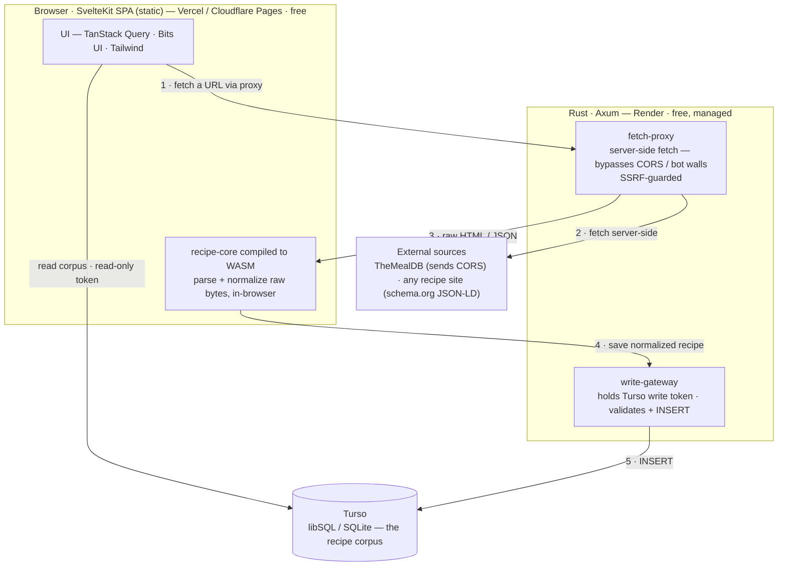

# recipes

A cooking **recipe aggregator** — it normalizes recipes from existing public
sources (TheMealDB, and any site that publishes schema.org/Recipe data) into one
shape and builds them into a searchable corpus. It is _not_ a CMS: you don't
author recipes here.

## Architecture



**The client does the heavy lifting; the backend is deliberately thin.** The
same Rust crate (`recipe-core`) that could parse on the server is compiled to
**WASM and runs in the browser**, so parsing/normalization happens client-side.
The backend only does the two things a browser _can't_:

1. **Fetch external pages** — browsers can't fetch arbitrary cross-origin sites
   (CORS), and recipe sites actively block scrapers. The backend fetches them
   server-side and returns the raw bytes. (TheMealDB is the exception — it sends
   `Access-Control-Allow-Origin: *`, so the browser calls it directly.)
2. **Write to the database** — the Turso write token must never ship to a public
   browser, so all writes go through the backend write-gateway. Reads use a
   separate read-only token and go direct from the browser.

### Why these choices

| Decision      | Choice                                                            | Why                                                                                                                                                                     |
| ------------- | ----------------------------------------------------------------- | ----------------------------------------------------------------------------------------------------------------------------------------------------------------------- |
| Backend host  | **Render** — free, managed, runs a Rust Docker image              | Keeps Rust without a self-managed box. Shuttle's free tier ended 2025‑12‑19; a VPS (Hetzner) would mean owning host security/patching. Render is managed and card-free. |
| Database      | **Turso** — libSQL/SQLite, 5 GB free                              | Managed SQLite: our original SQLite cache design maps over almost 1:1, with no persistent-volume host to run.                                                           |
| Frontend      | **SvelteKit** SPA (`adapter-static`) on Vercel / Cloudflare Pages | All logic is client-side, so the frontend is a static bundle — free to host anywhere.                                                                                   |
| Processing    | **Rust → WASM** in the browser                                    | One parser, shared by server and client; keeps compute off the (free, small) backend.                                                                                   |
| Backend scope | fetch-proxy + write-gateway only                                  | The only jobs that genuinely require a server: cross-origin fetches and holding secrets.                                                                                |

The all-in-one alternative (everything on Cloudflare Workers + D1 + KV) is
cheaper still, but its free CPU cap forces a TypeScript backend — it would mean
dropping Rust, so we didn't take it.

## Layout

```
crates/recipe-core   shared Rust — models + schema.org + TheMealDB normalize (native + wasm32)
crates/recipe-wasm   wasm-bindgen wrapper → npm package the frontend imports        [wip]
backend/             Axum fetch-proxy + Turso write-gateway (deploys to Render)      [wip]
frontend/            SvelteKit SPA — TanStack Query · Bits UI · Tailwind             [wip]
flake.nix            rainix `wasm-shell` dev env (Rust + wasm-pack + Node)
```

## Getting started

The dev toolchain comes from [rainix](https://github.com/rainlanguage/rainix)
via Nix — Rust (+ `wasm-pack`), Node, and the shared formatting/CI tooling:

```sh
nix develop
```

- **Shared crate:** `cargo test -p recipe-core`
- **WASM build:** `cargo build -p recipe-core --target wasm32-unknown-unknown`
- Backend and frontend instructions land as those crates are built out.

## Status

Early. `recipe-core` (the shared normalization logic) exists and is tested; the
backend is being reshaped into the fetch-proxy/write-gateway above, and the
`recipe-wasm` package and SvelteKit frontend are next.

## License

[MIT](./LICENSE)
